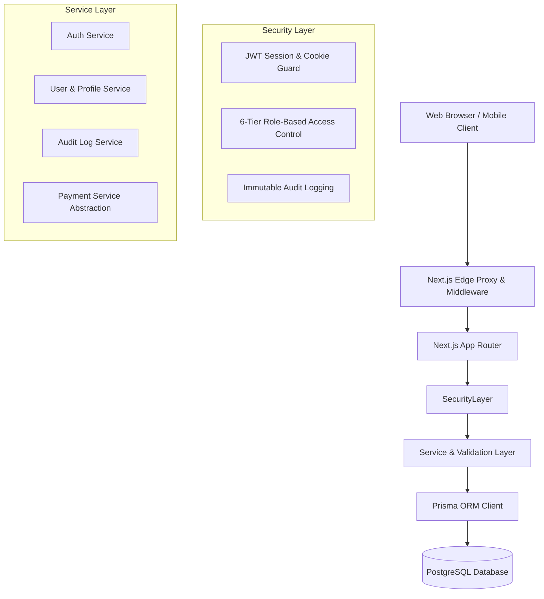

# System Architecture

## 1. Overview & Vision

This platform is a production-grade, white-label healthcare practice and doctor appointment management platform. It allows healthcare clinics, nursing homes, and private practices to manage their entire digital presence, doctor schedules, patient appointments, and payments through an intuitive CMS dashboard without modifying source code.



## 2. Directory Structure

```
├── docs/                   # System architectural and operator guides
├── prisma/
│   ├── schema.prisma       # 17 PostgreSQL data models
│   └── seed.ts             # Safe development seed
├── scripts/
│   └── create-admin.ts     # CLI for secure admin provisioning
├── src/
│   ├── app/
│   │   ├── (auth)/         # Auth pages (login, signup, password reset)
│   │   ├── (dashboard)/    # Role-based dashboards (admin, doctor, receptionist, patient)
│   │   ├── api/            # API Route handlers
│   │   │   └── auth/       # Login, Signup, Logout, Me, Password reset
│   │   ├── layout.tsx      # Root application layout
│   │   └── page.tsx        # Public landing foundation
│   ├── components/
│   │   ├── auth/           # Interactive auth forms
│   │   └── ui/             # Accessible UI primitives (Button, Input, Card, Badge)
│   ├── lib/
│   │   ├── auth/           # RBAC matrix, JWT sessions, bcrypt passwords, reset tokens
│   │   ├── services/       # Core business logic (auth, audit)
│   │   ├── utils/          # API response helpers, global error handler
│   │   ├── validators/     # Strict Zod schemas
│   │   ├── db.ts           # Prisma client singleton
│   │   └── env.ts          # Zod environment validation
│   └── middleware.ts       # Edge route protection & security headers
└── tests/
    ├── unit/               # Unit tests (password, session, rbac, validators, api response)
    └── integration/        # Service layer integration tests
```

## 3. Technology Stack

- **Framework**: Next.js 16 (App Router, Turbopack, React 19)
- **Database & ORM**: PostgreSQL with Prisma ORM 6.4
- **Language**: TypeScript 5 (Strict Mode)
- **Styling**: Tailwind CSS v4
- **Authentication**: Stateless signed JWTs with `jose`, HTTP-only secure cookies
- **Password Hashing**: bcryptjs (12 salt rounds)
- **Validation**: Zod
- **Testing**: Vitest with `@testing-library`
