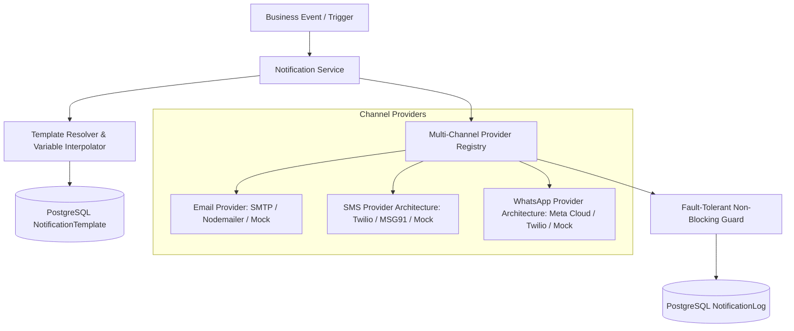

# Phase 8: Notification Architecture & Multi-Channel Engine

## 1. Overview & Vision

The Notification Engine is a decoupled, fault-tolerant, multi-channel communication system designed to keep patients, doctors, and clinic staff updated throughout the clinical care lifecycle.



---

## 2. Supported Events (The 7 Core Events)

| # | Event | Channels | Dynamic Variables |
|---|---|---|---|
| **1** | `APPOINTMENT_BOOKED` | Email, SMS, WhatsApp | `patientName`, `doctorName`, `clinicName`, `appointmentNumber`, `appointmentDate`, `appointmentTime`, `appointmentType` |
| **2** | `PAYMENT_SUCCESSFUL` | Email, SMS, WhatsApp | `patientName`, `amount`, `paymentMethod`, `transactionId`, `receiptNumber`, `appointmentNumber` |
| **3** | `APPOINTMENT_CANCELLED` | Email, SMS, WhatsApp | `patientName`, `doctorName`, `appointmentDate`, `cancellationReason`, `clinicPhone` |
| **4** | `APPOINTMENT_RESCHEDULED`| Email, SMS, WhatsApp | `patientName`, `doctorName`, `appointmentDate`, `appointmentTime`, `rescheduledDate`, `rescheduledTime` |
| **5** | `APPOINTMENT_REMINDER` | Email, SMS, WhatsApp | `patientName`, `doctorName`, `appointmentDate`, `appointmentTime`, `clinicAddress` |
| **6** | `DOCTOR_SCHEDULE_CHANGED`| Email, SMS, WhatsApp | `patientName`, `doctorName`, `scheduleChangeDetails`, `clinicPhone` |
| **7** | `APPOINTMENT_COMPLETED` | Email, SMS, WhatsApp | `patientName`, `doctorName`, `appointmentNumber`, `appointmentDate`, `notes` |

---

## 3. Provider Abstraction & Architecture

All providers follow clean, decoupled interfaces defined in `src/lib/notifications/providers/provider.interface.ts`.

### Email Provider
- **Active Implementation**: `SmtpEmailProvider` (production) and `MockEmailProvider` (development & automated test isolation).
- **Supports**: Custom HTML rendering, plaintext fallbacks, customizable sender addresses (`from`), and reply-to headers.

### SMS Provider Architecture (Zero Hardcoding)
- **Interface**: `ISmsProvider`
- **Adapters**:
  - `TwilioSmsProvider`: Global SMS delivery via Twilio REST API.
  - `Msg91SmsProvider`: Indian DLT-compliant SMS delivery with Flow Template IDs.
  - `MockSmsProvider`: In-memory test driver.

### WhatsApp Provider Architecture (Zero Hardcoding)
- **Interface**: `IWhatsAppProvider`
- **Adapters**:
  - `MetaWhatsAppProvider`: Official Meta Cloud API (WhatsApp Business Graph API v19.0+) with parameter mapping and template messaging.
  - `TwilioWhatsAppProvider`: Twilio WhatsApp Business Sandbox and production integration.
  - `MockWhatsAppProvider`: In-memory test driver.

---

## 4. CMS & Admin Template Configuration

Templates are fully manageable directly from the Admin Dashboard (`/dashboard/admin` -> 🔔 Notifications):

1. **Custom Subject & Body**: Admin can edit HTML email layouts or short SMS/WhatsApp text without changing application code.
2. **Variable Badges**: Click-to-insert placeholder chips (`{{patientName}}`, `{{doctorName}}`, `{{appointmentDate}}`, etc.).
3. **Active/Inactive Toggle**: Turn notifications on or off per channel or event.
4. **Reset to Default**: Instantly revert any template back to the factory specification.

---

## 5. Security & Zero Secret Exposure

- **Server-Only Credentials**: Secrets (`SMTP_PASS`, `TWILIO_AUTH_TOKEN`, `WHATSAPP_ACCESS_TOKEN`, `MSG91_AUTH_KEY`) are kept in server environment variables and never returned in API payloads.
- **Provider Status API**: Returns safe health indicators (`{ isConfigured: true, name: "TwilioSmsProvider" }`) without leaking keys, tokens, or credentials to the client.

---

## 6. Fault Tolerance & Failure Resilience

1. **Non-Blocking Execution**: Notification dispatch is fire-and-forget relative to the core business transaction. If an email server times out or an SMS gateway returns 429, the appointment booking or payment transaction **never fails**.
2. **Comprehensive Delivery Logs (`NotificationLog`)**:
   - Every dispatch attempt records `recipient`, `event`, `channel`, `provider`, `status` (`SENT`, `DELIVERED`, `FAILED`), and `errorMessage`.
   - Admins can inspect failures and retry or diagnose errors directly from the admin interface.

---

## 7. Verification & Quality Gates

Run the dedicated Phase 8 test suite:

```bash
npm test -- tests/integration/phase8-notification-architecture.test.ts
```

Run TypeScript compilation check:

```bash
npm run typecheck
```
