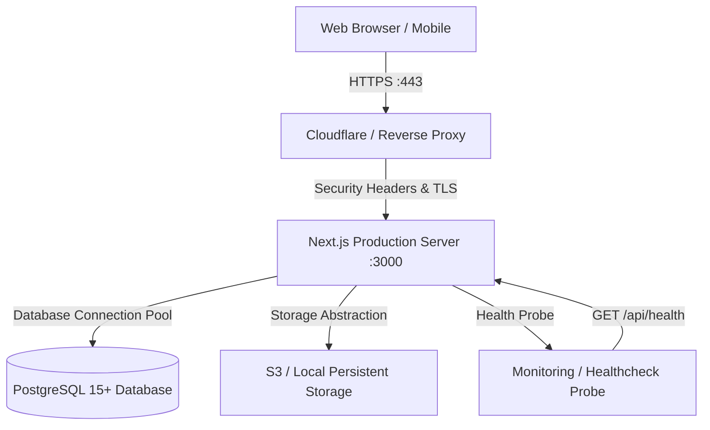

# Production Deployment & Operations Guide

This guide details the steps and security hardening required to deploy the **AyurvedaCare Clinic Platform** to production environments.

---

## 1. Production Architecture Overview

The system is architected as a containerized or VM-deployed Next.js full-stack platform backed by PostgreSQL with multi-tenant data isolation:



---

## 2. Environment Variables Checklist

Ensure all variables in `.env.production.example` are populated in your production environment management system (e.g. AWS SSM, Docker Swarm Secrets, Kubernetes Secrets, or Doppler):

- `NODE_ENV="production"`
- `PORT=3000`
- `DATABASE_URL` (with SSL required and connection pooling)
- `JWT_SECRET` (minimum 48-character random string)
- `SESSION_COOKIE_NAME="__Host-ayurvedacare_session"`
- `STORAGE_DRIVER="local"` or `"s3"`
- Payment keys (`RAZORPAY_KEY_ID`, `RAZORPAY_KEY_SECRET`)
- Notification gateways (Resend, Twilio, WhatsApp Cloud API)

---

## 3. Database Migration Strategy

### Zero-Downtime Migration Protocol
1. Never run `prisma db push` in production. Always use version-controlled migrations:
   ```bash
   npx prisma migrate deploy
   ```
2. Verify migration status:
   ```bash
   npx prisma migrate status
   ```
3. Initial clinic seeding (only for first-time installation):
   ```bash
   npm run db:seed
   ```

---

## 4. Secure Cookies & Authentication

In production (`NODE_ENV="production"`):
- All session cookies are configured with:
  - `httpOnly: true` (prevents JavaScript/XSS access)
  - `secure: true` (transmitted only over HTTPS)
  - `sameSite: "lax"` (mitigates CSRF vulnerabilities)
  - `path: "/"`
  - `maxAge: 7 days` (sliding session duration)
- The cookie name uses the standard `__Host-` prefix in production.

---

## 5. Reverse Proxy & Security Headers

Next.js is preconfigured in `next.config.ts` to output enterprise security headers on all routes:
- **Strict-Transport-Security (HSTS)**: `max-age=63072000; includeSubDomains; preload`
- **X-Frame-Options**: `SAMEORIGIN` (prevents clickjacking)
- **X-Content-Type-Options**: `nosniff` (prevents MIME sniffing)
- **Referrer-Policy**: `strict-origin-when-cross-origin`
- **Permissions-Policy**: `camera=(), microphone=(), geolocation=()`
- **Content-Security-Policy (CSP)**: restricts unauthorized scripts and frames
- `poweredByHeader: false` (removes `X-Powered-By: Next.js`)

When deploying behind Nginx or Cloudflare, ensure your upstream terminates TLS and forwards headers:
```nginx
proxy_set_header X-Forwarded-For $proxy_add_x_forwarded_for;
proxy_set_header X-Forwarded-Proto $scheme;
proxy_set_header Host $http_host;
```

---

## 6. Rate Limiting Protection

Sensitive endpoints (authentication, appointment creation, payment initiation) utilize our in-memory sliding window rate limiter (`src/lib/security/rate-limit.ts`).
- Public booking endpoints: 60 requests per minute per IP.
- Login / Auth endpoints: 10 attempts per minute per IP.
- When breached, the server returns `HTTP 429 Too Many Requests` with `X-RateLimit-*` diagnostic headers.

---

## 7. Storage Configuration

### Local Persistent Storage (Default)
Mount a persistent Docker volume to `/app/public/uploads` so uploaded media assets survive container restarts and deployments.

### Object Storage (AWS S3 / Cloudflare R2)
Set `STORAGE_DRIVER="s3"` and configure `S3_BUCKET_NAME`, `S3_REGION`, `S3_ACCESS_KEY_ID`, and `S3_SECRET_ACCESS_KEY`. The platform's storage abstraction automatically routes all media uploads to the cloud bucket.

---

## 8. Backup & Disaster Recovery Strategy

### Automated PostgreSQL Backup Script
Run daily cron jobs to create timestamped backups of the PostgreSQL database:
```bash
#!/bin/bash
TIMESTAMP=$(date +"%Y%m%d_%H%M%S")
BACKUP_DIR="/backups/postgresql"
mkdir -p "$BACKUP_DIR"

pg_dump -Fc "$DATABASE_URL" > "$BACKUP_DIR/clinic_backup_$TIMESTAMP.dump"

# Retain backups for 30 days
find "$BACKUP_DIR" -type f -name "*.dump" -mtime +30 -exec rm {} +
```

### Media Asset Backups
Ensure the storage volume or S3 bucket has cross-region replication or versioning enabled.

---

## 9. Health Checks & Monitoring

The platform provides a dedicated health check probe at `/api/health`.

### Health Check Endpoint:
```
GET /api/health
```

### Sample Response:
```json
{
  "status": "healthy",
  "timestamp": "2026-10-05T05:30:00.000Z",
  "uptimeSeconds": 1420,
  "checks": {
    "database": {
      "status": "healthy",
      "latencyMs": 4
    },
    "storage": {
      "status": "healthy",
      "driver": "local"
    },
    "memory": {
      "rssMb": 182,
      "heapUsedMb": 94,
      "heapTotalMb": 128
    }
  },
  "meta": {
    "nodeEnv": "production",
    "version": "1.0.0",
    "responseTimeMs": 6
  }
}
```

Configure your container orchestrator (Kubernetes, AWS ECS, Docker Compose) with this liveness/readiness probe:
- **Path**: `/api/health`
- **Interval**: 30 seconds
- **Timeout**: 5 seconds
- **Unhealthy Threshold**: 3 retries

---

## 10. Building and Running Production

1. Compile the production bundle:
   ```bash
   npm run build
   ```
2. Start the production server:
   ```bash
   npm run start
   ```
3. Verify status:
   ```bash
   curl -I https://clinic.yourdomain.com/api/health
   ```
